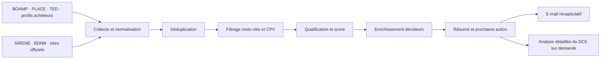

# Architecture de l’agent commercial

Version de travail — 5 août 2026

## 1. Mission

L’agent doit détecter, qualifier et résumer les opportunités liées aux toitures réfléchissantes, à la peinture de toiture, à l’entretien de grandes toitures et aux lots de couverture ou d’étanchéité pouvant accepter une solution réflective.

Il ne répond pas automatiquement à un marché et n’envoie pas de prospection sans validation humaine. Il prépare la décision et le travail du dirigeant.

## 2. Résultat attendu

Un e-mail récapitulatif contient pour chaque opportunité :

- entité ou entreprise ;
- public ou privé ;
- description en deux phrases ;
- lieu d’exécution ;
- surface et montant lorsqu’ils sont indiqués ;
- date de publication, visite éventuelle et date limite ;
- lien direct vers l’avis et vers le dossier de consultation ;
- décideurs ou services identifiés, avec source ;
- score d’intérêt sur 100 ;
- prochaine action recommandée ;
- brouillon d’e-mail ou angle d’appel lorsque le dossier est suffisamment qualifié.

## 3. Sources

### Marchés publics

1. API BOAMP, gratuite et structurée.
2. PLACE et ses alertes quotidiennes ou hebdomadaires.
3. TED pour les procédures européennes et les grands marchés.
4. Profils d’acheteurs régionaux ou privés : AWS-Achat, Marchés Sécurisés et autres plateformes rencontrées dans les avis.
5. APProch pour les projets d’achats publics annoncés en amont.

L’API BOAMP doit être la source principale. Les alertes et pages publiques complètent les marchés de faible montant qui ne sont pas tous centralisés de la même manière.

### Prospection privée

1. SIRENE pour sélectionner les établissements actifs par secteur, localisation et taille.
2. BDNB pour qualifier les bâtiments et les grandes emprises lorsque les données ouvertes le permettent.
3. Sites officiels des entreprises et collectivités pour identifier les fonctions et coordonnées professionnelles publiées.
4. Pages de patrimoine, rapports RSE, plans de sobriété énergétique et annonces de travaux.

Pas de scraping massif de Google Maps ou de LinkedIn. Les données doivent provenir de sources ouvertes ou de services dont les conditions autorisent la réutilisation.

## 4. Flux de traitement

## 5. Filtres marchés publics

### Codes CPV de départ

- 45260000-7 — Travaux de couverture et autres travaux spécialisés.
- 45261200-6 — Travaux de couverture et de peinture de toiture.
- 45261220-2 — Travaux de peinture de couverture et application d’enduits.
- 45261221-9 — Travaux de peinture de toiture.
- 45261420-4 — Travaux d’étanchéification.
- 45261900-3 — Réparation et entretien de toiture.
- 45261920-9 — Entretien de toiture.

### Mots-clés positifs

`cool roof`, `toiture fraîche`, `toiture rafraîchissante`, `toiture réfléchissante`, `thermo-réflectif`, `thermoréflectif`, `réflectance`, `albédo`, `peinture de toiture`, `toiture blanche`, `bac acier`, `couverture métallique`, `calandrite`, `membrane bitumineuse`, `étanchéité toiture`, `confort d’été`, `surchauffe`, `école`, `gymnase`, `entrepôt`, `logistique`.

### Mots-clés à surveiller comme opportunités indirectes

`réfection de toiture`, `rénovation énergétique`, `marché global de performance`, `travaux d’été`, `isolation toiture`, `désimperméabilisation`, `adaptation canicule`, `plan école`, `maintenance multitechnique`.

Ces dossiers ne seront retenus que si un lot, une variante ou une sous-traitance paraît réaliste.

## 6. Score d’intérêt

| Critère | Points |
|---|---:|
| Cool roof ou peinture réflective explicitement demandée | 25 |
| Grande toiture ou surface supérieure à 500 m² | 20 |
| PACA ou déplacement rentable | 15 |
| Entrepôt, industrie, grande surface, école ou gymnase | 15 |
| Délai de réponse encore exploitable | 10 |
| Montant ou budget cohérent | 5 |
| Visite, variante ou cotraitance possible | 5 |
| Coordonnées et dossier accessibles | 5 |

- 75–100 : alerte prioritaire le jour même.
- 55–74 : opportunité à examiner dans le récapitulatif.
- 35–54 : veille ou prospection indirecte.
- Moins de 35 : archivé, sauf décision humaine.

## 7. Analyse d’un dossier de consultation

L’agent extrait et cite les passages pertinents du RC, CCTP, CCAP, acte d’engagement, DPGF/BPU/DQE :

- objet, lots et périmètre ;
- support, surface, procédé demandé et performances ;
- visite obligatoire et questions avant remise ;
- qualifications, références, assurances et capacités minimales ;
- variantes, sous-traitance ou cotraitance ;
- critères de notation et mémoire technique attendu ;
- planning, pénalités, retenue de garantie et conditions de paiement ;
- pièces à remettre et signatures ;
- incohérences, risques et questions à adresser à l’acheteur ;
- décision recommandée : répondre, rechercher un partenaire ou abandonner.

Chaque fait doit renvoyer au document et à la page correspondante. L’agent ne doit jamais inventer une exigence absente du dossier.

## 8. Prospection privée

### Sélection des comptes

- PACA en priorité.
- Établissements logistiques, industriels, agroalimentaires, frigorifiques, commerciaux ou sportifs.
- Grandes emprises de toiture et effectifs suffisants.
- Sites climatisés, sensibles à la chaleur ou engagés dans une démarche énergétique.
- Déclencheurs : canicule, rénovation, réfection de toiture, extension, installation photovoltaïque, plan RSE ou décret tertiaire.

### Enrichissement des décideurs

Chercher en premier lieu une fonction, puis une personne : direction du site, maintenance, immobilier, énergie/RSE, achats ou services techniques. Conserver l’URL de la source et la date de vérification.

### Règles de contact

- Objet du message directement lié à la fonction professionnelle du destinataire.
- Expéditeur et entreprise clairement identifiés.
- Message court, personnalisé et fondé sur un besoin plausible du site.
- Moyen simple de s’opposer aux futurs messages.
- Pas de pixel de suivi intrusif par défaut.
- Liste d’opposition conservée et appliquée à tous les envois suivants.

## 9. Modèle de récapitulatif e-mail

**Objet : Radar toiture réfléchissante — 3 opportunités prioritaires — 5 août 2026**

### 1. Ville de X — Réfection de la toiture du gymnase

- Score : 82/100 — priorité haute
- Lieu : Var
- Besoin : réfection d’une toiture bitumineuse ; variante réflective à vérifier
- Surface : 1 850 m²
- Budget : non communiqué
- Date limite : 28 août 2026 à 12 h
- Décideur/service : Direction des bâtiments — source vérifiée
- Action : télécharger le DCE et vérifier la visite obligatoire
- Liens : avis | profil acheteur | DCE

### 2. Entreprise Y — plateforme logistique

- Score : 71/100
- Lieu : Bouches-du-Rhône
- Signal : bâtiment de grande emprise, activité sensible à la chaleur
- Décideur probable : responsable maintenance du site
- Action : appel de qualification puis e-mail préparé
- Sources : site officiel | SIRENE | fiche bâtiment

## 10. Données minimales à conserver

| Champ | Usage |
|---|---|
| Identifiant de source et URL | Déduplication et traçabilité |
| Type public/privé | Routage du traitement |
| Acheteur ou compte | Regroupement des opportunités |
| Localisation | Filtre géographique |
| Dates | Priorisation et rappels |
| Surface et budget | Qualification économique |
| CPV et mots-clés | Explication du score |
| Documents | Analyse du dossier |
| Contacts et sources | Préparation de l’approche |
| Statut et prochaine action | Suivi commercial |
| Refus de contact | Conformité prospection |

## 11. Fiabilité et exploitation

- Déduplication par identifiant d’avis, URL canonique et acheteur.
- Nouvelle tentative en cas d’indisponibilité temporaire d’une source.
- Journal de collecte avec date et résultat.
- Alerte distincte si une date limite est à moins de cinq jours.
- Validation humaine avant tout envoi externe ou réponse à un marché.
- Conservation des sources utilisées pour chaque résumé.
- Revue mensuelle des faux positifs et mots-clés manquants.

## 12. Mise en œuvre progressive

### MVP — activé

- BOAMP, PLACE et TED.
- Filtre PACA, CPV et mots-clés.
- Score, déduplication et e-mail récapitulatif.
- Analyse manuelle assistée des DCE sélectionnés.
- Envoi tous les matins à 9 h à `francetracage@gmail.com`, y compris lorsqu’aucune nouvelle opportunité n’est détectée.

### Phase 2

- SIRENE et BDNB pour les comptes privés.
- Enrichissement des décideurs depuis les sites officiels.
- Brouillons d’e-mails et scripts d’appel.
- Tableau de suivi du pipeline.

### Phase 3

- Mesure des résultats, amélioration du score et extension géographique.
- Bibliothèque de réponses, références et pièces administratives.
- Préremplissage encadré des mémoires techniques, sans envoi automatique.

## 13. Paramètres confirmés

- Cadence du récapitulatif : tous les jours à 9 h, avec les avis repérés depuis la veille et le jour même.
- Destinataire : `francetracage@gmail.com`.
- L’agent envoie le récapitulatif depuis la boîte Gmail actuellement connectée à Codex.
- Le dirigeant reste responsable de la décision de répondre, du prix, du choix du procédé et de l’envoi final.
